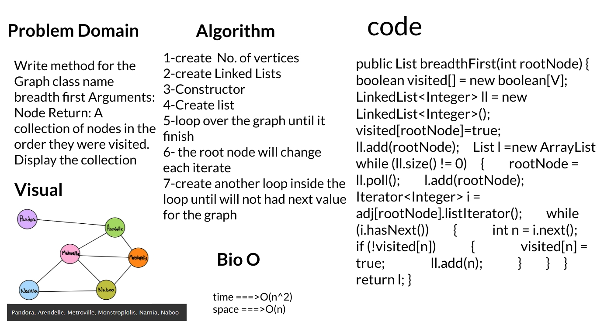
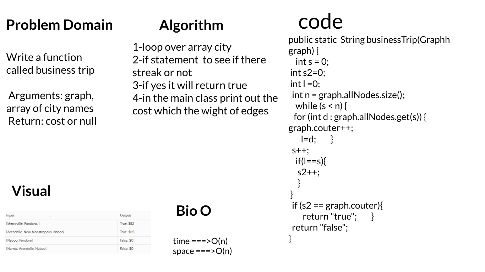

# Graph

A graph is a data structure that stores connected data. In other words, a graph G (or g) is defined as a set of vertices (V) and edges (E) that connects vertices. The examples of graph are a social media network, computer network, Google Maps, etc.

## Challenge

1. add node

* Arguments: value
* Returns: The added node
* Add a node to the graph

1. add edge

* Arguments: 2 nodes to be connected by the edge, weight (optional)
* Returns: nothing
* Adds a new edge between two nodes in the graph
* If specified, assign a weight to the edge
* Both nodes should already be in the Graph

1. get nodes

* Arguments: none
* Returns all of the nodes in the graph as a collection (set, list, or similar)

1. get neighbors

* Arguments: node
* Returns a collection of edges connected to the given node
* Include the weight of the connection in the returned collection

1. size

* Arguments: none
* Returns the total number of nodes in the graph

## Approach & Efficiency

1. add node

- Time--->O(1)
- Space--->O(n)

1. add edge

- Time--->O(n)
- Space--->O(n)

1. get nodes

- Time--->O(n)
- Space--->O(n)

1. get neighbors

- Time--->O(n)
- Space--->O(n)

1. size

- Time--->O(1)
- Space--->O(1)*   

# Code Challenge 36

# Code Challenge 37

