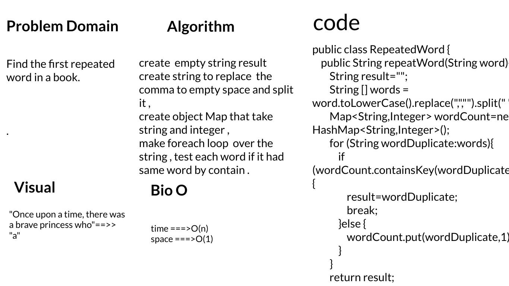
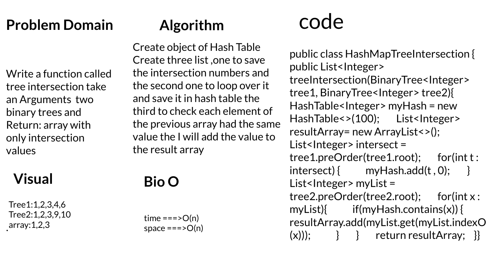

# Challenge 30

**- Implement a Hashtable with the following methods:**

- add: takes in both the key and value. This method should hash the key, and add the key and value pair to the table, handling collisions as needed.
- get: takes in the key and returns the value from the table.
- contains: takes in the key and returns a boolean, indicating if the key exists in the table already.
- hash: takes in an arbitrary key and returns an index in the collection.

**- Approach & Efficiency**

- all function take O(1) time.

- This hash table will implement separate chaining as the method to deal with collisions. Separate chaining involves storing entries in the hashtable in an array of linked lists so that even if a collision was to happen, the entry would just be added on to the linked list at that index of the array.

# Challenge 31

# Challenge 32

