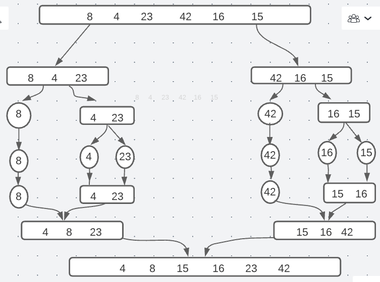

# Merge Sort

# BLOG:

* In fuction sort we will devied the array to left side and right side till we get one element in left ,right after that we will swap between left and right depend on the value from smallest to the biger one :

