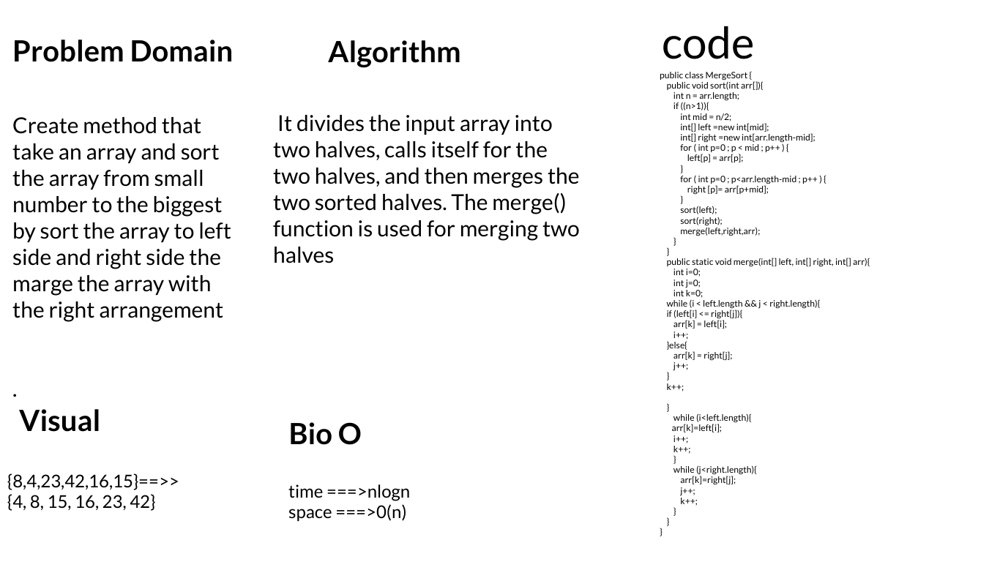

# Challenge Summary

- Create method that take an array and sort the array from small number to the biggest by sort the array to left side and right side the marge the array with the right arrangement

## Whiteboard Process

## Approach & Efficiency

* time ===>nlogn
* space ===>0(n)

