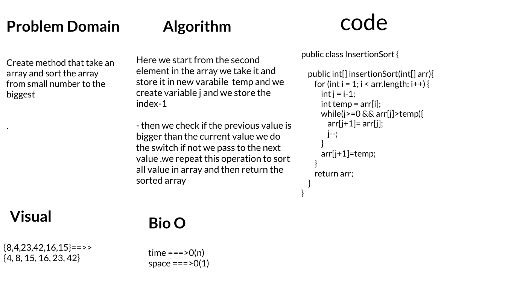

# Challenge Summary
- Create method that take an array and sort the array from small number to the biggest 
  

## Whiteboard Process

## Approach & Efficiency
time ===>0(n)

space ===>0(1)

## Solution

- copy and paste in class InsertionSort,in the main create new object from insertionSort ==>`  InsertionSort insertionSort=new InsertionSort()`
- create new arr `int [] arr = {8,4,23,42,16,15};`
- to see the result `System.out.println(Arrays.toString(insertionSort.insertionSort(arr)));`

