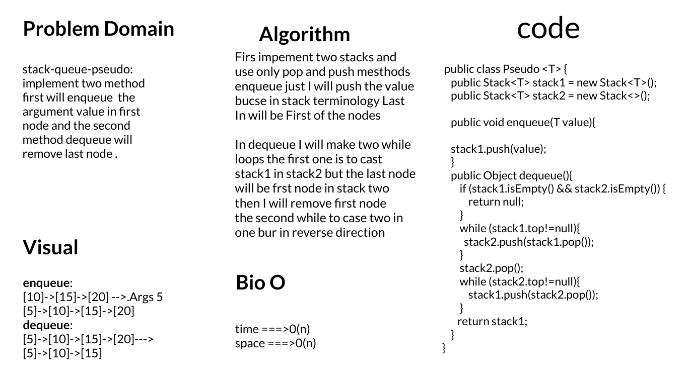
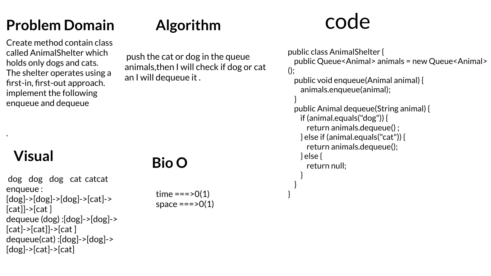
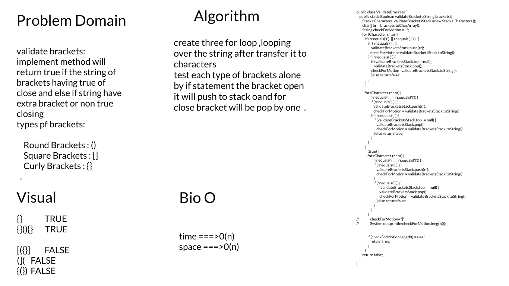

# Stacks and Queues
the Main idea of stacks :
- FILO
  - First In Last Out
  - This means that the first item added in the stack will be the last item popped out of the stack.
- LIFO
  - Last In First Out
  - This means that the last item added to the stack will be the first item popped out of the stack
the Main idea of Queue:
- FIFO
   - First In First Out
   - This means that the first item in the queue will be the first item out of the queue.
- LILO
   - Last In Last Out
   - This means that the last item in the queue will be the last item out of the queue

## Challenge
- make methods for stack (push,pop,peek,isEmpty)
- make methods for Queue (enqueue,dequeue,peek,isEmpty)

## Approach & Efficiency
- it take less size in the momoery and the process will done more faster

push  :O(1)
Enqueue : O(1)
pop : O(1)
dequeue : O(1)
isEmpty : O(1)
peek : O(1)

## API
# Code Challenge 11

# code challenge 12

Approach & Efficiency

the complexity for the :

    enqueue : time > O(1) 
              space> O(1)
    dequeue : time > O(1) 
                space> O(1)

# Code Challenge 13

