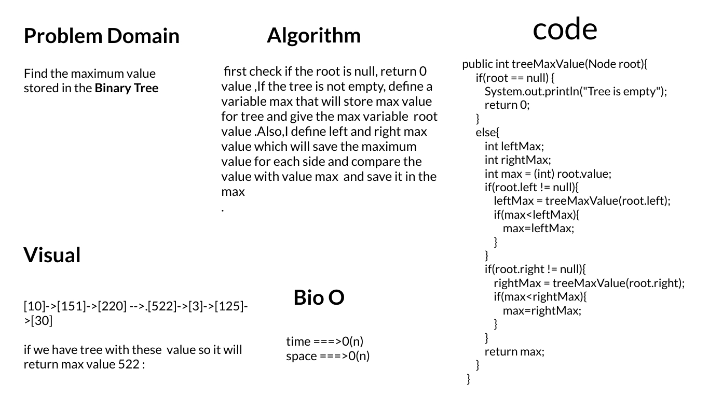
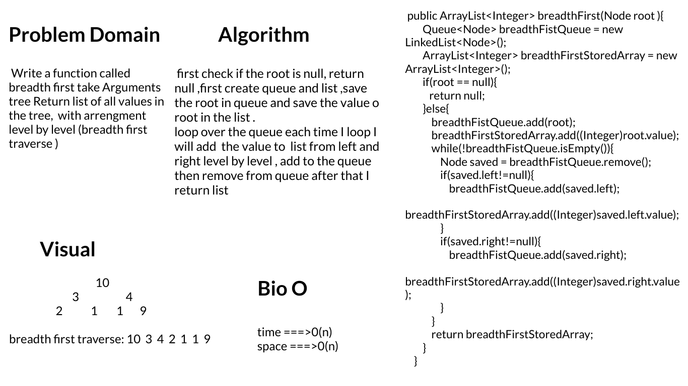

# Trees
<!-- Short summary or background information -->

## Challenge 15
**Binary Tree**

- Create a Binary Tree class
- Define a method for each of the depth first traversals:
1. pre order
2. in order
3. post order which returns an array of the values, ordered appropriately.
**Binary Search Tree**

Create a Binary Search Tree class
This class should be a sub-class (or your languages equivalent) of the Binary Tree Class, with the following

**- additional methods:**
- Adds a new node with that value in the correct location in the binary search tree.

**- Contains**
- Returns boolean indicating whether or not the value is in the tree at least once

## Approach & Efficiency
All the methods take O(n)

## API

**Depth First**

1. Pre-order: root >> left >> right
2. In-order: left >> root >> right
3. Post-order: left >> right >> root

**Searching a BST**

- Searching a BST can be done quickly, because all you do is compare the node you are searching for against the root of the tree or sub-tree. If the value is smaller, you only traverse the left side. If the value is larger, you only traverse the right side.

# Challenge 16
**Tee-max**

# Challenge 17
**breadth first traverse**

